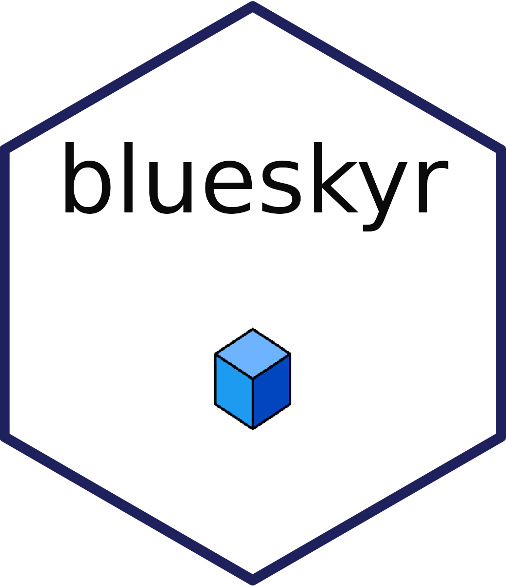
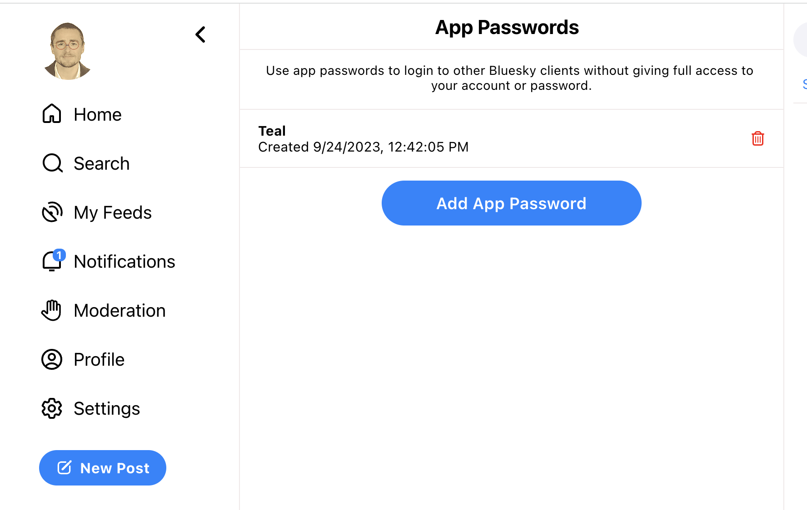
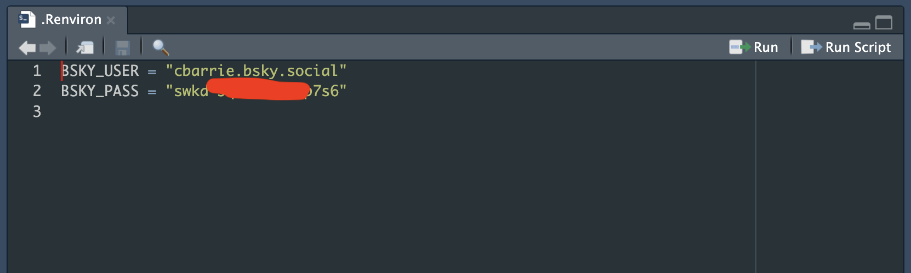

# blueskyr 

This is a working repository for adding functions to the `blueskyr` package as the API develops. At present, the only functions is a posting function `post_bsky()` that posts to the BlueSky platform.

## Authentication

In order to set up your environment variables, follow this workflow:

First, on the BlueSky platform, go to "Settings" and create and App Password. Make a note of this as you will not be able to copy it again.



Then open your Renviron with:

```{r}
usethis::edit_r_environ()
```

After you've done this, input your details in as below:



Then, **make sure to restart your R Session**.

Once you've done this, you should be ready to use the package with:

```{r}
devtools::install_github("cjbarrie/blueskyr")
library(blueskyr)
```

And you can make your first post with:

```{r}
post_bsky("This is my first post")
```
